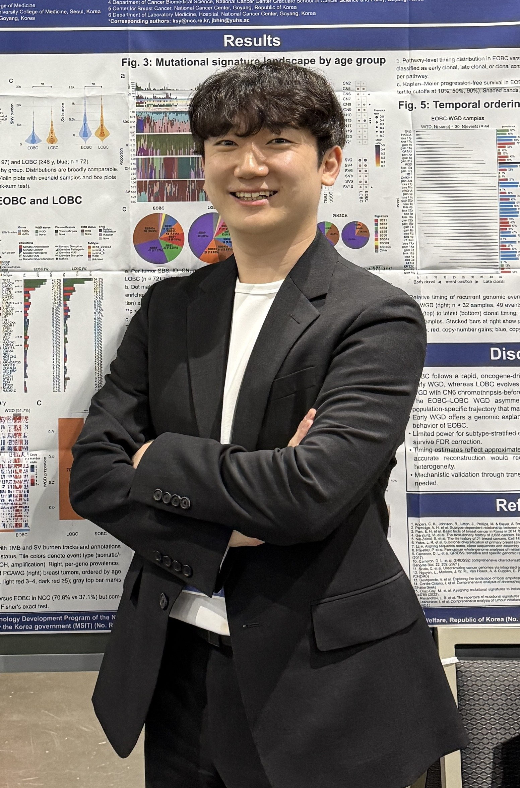

# Sejung Lee 개인 포트폴리오 홈페이지

이 프로젝트는 Sejung (이세중) Lee의 개인 연구자 포트폴리오 홈페이지입니다. 별도의 빌드 도구 없이 `HTML + CSS + JavaScript`만으로 구성된 정적 웹사이트라서, 파일을 수정한 뒤 브라우저에서 바로 확인할 수 있습니다.

## 1. 현재 디렉토리 구조

```text
mypage/
├─ index.html
├─ about.html
├─ work.html
├─ process.html
├─ contact.html
├─ README.md
└─ assets/
   ├─ css/
   │  └─ styles.css
   ├─ js/
   │  └─ script.js
   └─ images/
      ├─ sejung_profile.jpg
      └─ SV.jpeg
```

각 파일의 역할은 아래와 같습니다.

| 파일/폴더 | 역할 |
| --- | --- |
| `index.html` | 메인 페이지입니다. 첫 화면 소개, 핵심 연구 키워드, 대표 활동 요약이 들어갑니다. |
| `about.html` | 상세 소개 페이지입니다. 기본 정보, 연구 요약, 교육/초기 연구 경험, 수상 내역을 정리합니다. |
| `work.html` | 연구/프로젝트 페이지입니다. cancer evolution, WGS/transcriptomics, AACR 2026 활동을 보여줍니다. |
| `process.html` | 연구 방법과 기술 스택을 설명하는 페이지입니다. 데이터 분석 흐름과 실험/계산 기술을 정리합니다. |
| `contact.html` | 연락/협업 페이지입니다. LinkedIn 링크와 협업 관심사를 보여줍니다. |
| `assets/css/styles.css` | 전체 디자인, 레이아웃, 반응형 스타일, 카드/버튼/타이포그래피를 담당합니다. |
| `assets/js/script.js` | 배경 canvas 애니메이션, 원형 타일 플롯, `SV.jpeg` 배경 이미지 움직임, 스크롤 reveal 효과를 담당합니다. |
| `assets/images/sejung_profile.jpg` | 메인 페이지 오른쪽에 표시되는 프로필 사진입니다. |
| `assets/images/SV.jpeg` | 스크롤 시 배경 오른쪽에 자연스럽게 보이는 circular genomics 이미지입니다. |

## 2. 실행 방법

이 사이트는 정적 웹사이트라서 서버가 없어도 실행됩니다.

1. `C:\Users\sejung\Desktop\Agent\mypage\index.html` 파일을 브라우저로 엽니다.
2. 수정 후 브라우저를 새로고침합니다.
3. 이미지나 CSS가 바로 바뀌지 않으면 `Ctrl + F5`로 강력 새로고침합니다.

나중에 GitHub Pages, Netlify, Vercel 같은 정적 호스팅에 올릴 때도 이 구조를 거의 그대로 사용할 수 있습니다. 중요한 것은 `index.html`이 프로젝트 루트에 있어야 첫 페이지로 인식된다는 점입니다.

## 3. 페이지별 내용 수정 위치

### 메인 페이지: `index.html`

메인 페이지는 방문자가 가장 먼저 보는 페이지입니다. 너무 많은 정보를 넣기보다, 현재 정체성과 핵심 연구 방향만 빠르게 이해되도록 구성되어 있습니다.

주요 수정 위치:

```html
<h1>Sejung Lee</h1>
```

이 부분은 메인 페이지의 가장 큰 이름입니다.

```html
<p class="hero-lede">
  PhD student in bioinformatics and cancer genomics...
</p>
```

이 부분은 메인 소개 문장입니다. 한두 문장 정도로 짧게 유지하는 것이 좋습니다.

```html

```

메인 오른쪽 사진입니다. 사진 파일을 바꾸고 싶다면 `assets/images/sejung_profile.jpg` 파일을 교체하거나, 이 `src` 경로를 새 이미지 파일명으로 바꾸면 됩니다.

### 소개 페이지: `about.html`

`about.html`에는 상세 프로필과 연구자 소개가 들어갑니다.

수정하기 좋은 내용:

- 현재 직책: PhD Student
- 소속: Yonsei University
- 분야: Bioinformatics & Cancer Genomics
- 연구 요약
- 학부 전공 및 초기 연구 경험
- Presidential Science Scholarship
- LinkedIn profile metrics

정보가 많아질수록 메인 페이지보다는 `about.html`에 넣는 것이 좋습니다.

### 연구 페이지: `work.html`

`work.html`은 연구 관심사와 대표 활동을 보여주는 페이지입니다.

현재 핵심 흐름:

- Cancer evolution
- Whole Genome Sequencing / Transcriptomics
- Structural variation
- Drug response mechanisms
- AACR 2026 poster presentation

새 논문, 포스터, 프로젝트가 생기면 이 페이지에 카드나 섹션을 추가하는 것이 좋습니다.

### 연구 방식 페이지: `process.html`

`process.html`은 연구를 어떤 흐름으로 진행하는지 설명하는 페이지입니다.

현재 구조:

- Collect: 환자 유래 genomic/omics data 정리
- Analyze: WGS/transcriptomics 분석
- Interpret: driver mutation, structural alteration 해석
- Validate: 실험적/생물학적 맥락에서 검증
- Share: 학회, 협업, 네트워킹

기술 스택이나 분석 도구가 늘어나면 이 페이지를 확장하면 됩니다.

### 연락 페이지: `contact.html`

`contact.html`은 LinkedIn과 협업 가능 주제를 정리하는 페이지입니다.

LinkedIn 주소를 바꾸려면 아래와 같은 링크를 찾으면 됩니다.

```html
href="https://www.linkedin.com/in/sejung-lee-a05b61250"
```

## 4. 디자인 수정 위치: `assets/css/styles.css`

전체 시각 디자인은 `styles.css`에서 관리합니다.

### 색상 바꾸기

파일 맨 위의 `:root`에 전역 색상이 정의되어 있습니다.

```css
:root {
  --ink: #111214;
  --muted: #5f6673;
  --paper: #fdfdfb;
  --blue: #2b62ff;
  --green: #16a36b;
  --yellow: #fbbc04;
  --red: #ea4335;
}
```

자주 바꿀 만한 값:

- `--ink`: 본문과 제목의 기본 글자색
- `--muted`: 설명문, 부가 정보 색
- `--paper`: 전체 배경색
- `--blue`, `--green`, `--yellow`, `--red`: 포인트 컬러

전체 사이트 톤을 바꾸고 싶으면 여기부터 수정하는 것이 가장 안전합니다.

### 헤더와 메뉴

관련 클래스:

```css
.site-header
.brand
.site-nav
.header-action
```

메뉴 간격, 상단 고정 헤더, 네비게이션 링크 스타일을 담당합니다.

### 메인 첫 화면

관련 클래스:

```css
.hero-section
.hero-copy
.hero-lede
.hero-actions
.hero-photo
.hero-photo img
```

특히 메인 사진의 크기와 모양은 `.hero-photo`와 `.hero-photo img`에서 조정합니다.

사진 영역을 더 크게 만들고 싶다면:

```css
.hero-photo {
  min-height: 560px;
}
```

이 값의 숫자를 키우면 사진 영역이 커지고, 줄이면 작아집니다.

### 카드와 섹션

공통 카드 스타일:

```css
.project-card
.craft-card
.route-card
.tool-card
.contact-card
.process-step
```

공통 섹션 스타일:

```css
.section
.work-section
.craft-section
.about-section
.preview-section
.stack-section
.timeline-section
.tools-section
.contact-section
```

카드의 여백, 테두리, 배경색, hover 효과는 이 주변에서 수정합니다.

### 반응형 디자인

아래 구간은 화면 크기에 따라 레이아웃을 바꾸는 부분입니다.

```css
@media (max-width: 980px) { ... }
@media (max-width: 640px) { ... }
```

모바일에서 글자가 너무 크거나, 카드가 좁아 보이거나, 사진이 잘리는 경우 이 구간을 보면 됩니다.

## 5. 배경 애니메이션 수정 위치: `assets/js/script.js`

배경 효과는 `canvas`로 직접 그립니다. HTML에는 아래 요소가 있고, JS가 이 canvas에 매 프레임 그림을 그립니다.

```html
<canvas class="ambient-field" id="ambient-field"></canvas>
```

### 전체 흐름

`script.js`의 핵심 흐름은 다음과 같습니다.

1. `setupTileBackground()`
   - 이미지 로딩
   - 스크롤/리사이즈 이벤트 연결
   - 애니메이션 루프 시작

2. `resizeCanvas()`
   - 브라우저 크기에 맞춰 canvas 크기 조정
   - 원형 타일 플롯의 위치와 크기 계산
   - 타일과 보조 가이드 라인 재생성

3. `buildTiles()`
   - 원형 타일 하나하나의 위치, 색상, 두께, 펄스 속도 생성

4. `drawBackground(time)`
   - 매 프레임 실행되는 메인 그리기 함수
   - 종이 같은 배경, 원형 타일, fade, `SV.jpeg`를 순서대로 그림

5. `drawTiles(time)`
   - 타일별 깜빡임/pulse 애니메이션 담당

6. `drawSvImage(time, delta)`
   - `SV.jpeg`가 스크롤에 따라 자연스럽게 따라오도록 처리

7. `IntersectionObserver`
   - 페이지의 카드와 섹션이 스크롤 시 부드럽게 나타나도록 처리

### 원형 타일 플롯 크기 바꾸기

`resizeCanvas()` 안의 아래 줄을 찾으면 됩니다.

```js
wheelRadius = width < 720 ? Math.min(width * 0.72, 340) : Math.min(Math.max(width, height) * 0.35, 470);
```

의미:

- 모바일에서는 `width * 0.72`와 `340` 중 더 작은 값을 사용합니다.
- 데스크톱에서는 화면 크기 기준 `0.35`와 최대값 `470`을 사용합니다.

더 크게 만들고 싶으면:

```js
Math.max(width, height) * 0.38
```

또는 최대값 `470`을 `500`처럼 키우면 됩니다.

너무 커서 본문을 방해하면 `0.35`나 `470`을 줄이면 됩니다.

### 원형 타일 플롯 위치 바꾸기

같은 `resizeCanvas()` 안에서 아래 값을 수정합니다.

```js
wheelCenterX = width < 720 ? width * 0.06 : width * 0.14;
wheelCenterY = width < 720 ? height * 0.3 : height * 0.36;
```

의미:

- `wheelCenterX`: 원형 타일의 가로 중심 위치
- `wheelCenterY`: 원형 타일의 세로 중심 위치

오른쪽으로 옮기려면 `wheelCenterX` 값을 키우고, 왼쪽으로 옮기려면 줄입니다. 아래로 내리려면 `wheelCenterY` 값을 키우고, 위로 올리려면 줄입니다.

### 타일 두께와 밀도 바꾸기

`buildTiles()` 안에 타일 생성 관련 값들이 있습니다.

```js
const ringGap = width < 720 ? 42 : 48;
const slotSize = width < 720 ? 78 : 94;
const length = Math.min(18 + random() * (rightSide ? 24 : 30), maxLength);
const thickness = Math.min(ringGap * 0.46, 8.5 + random() * 7.5);
```

의미:

- `ringGap`: 원형 링 사이의 간격
- `slotSize`: 타일이 배치되는 간격. 작을수록 타일이 많아집니다.
- `length`: 타일의 길이
- `thickness`: 타일의 두께

타일이 너무 작아 보이면 `length`와 `thickness`를 키웁니다.

타일이 너무 빽빽하면 `slotSize`를 키우거나 `skipChance`를 높이면 됩니다.

### 타일 펄스 속도 바꾸기

`buildTiles()` 안의 아래 줄이 타일별 깜빡임 주기를 정합니다.

```js
const pulsePeriod = 11000 + random() * 18000;
```

단위는 밀리초입니다.

- 현재 값: 약 11초에서 29초 사이의 랜덤 펄스
- 더 천천히: `16000 + random() * 24000`
- 더 빠르게: `6000 + random() * 12000`

펄스를 완전히 끄고 싶으면 파일 상단의 값을 바꿉니다.

```js
const animateTilePulse = true;
```

`true`를 `false`로 바꾸면 펄스가 꺼집니다.

### 펄스 강도 바꾸기

`drawTiles(time)` 안에서 아래 부분을 찾습니다.

```js
const pulse = animateTilePulse ? Math.exp(-Math.pow((cycle - 0.5) / 0.095, 2)) : 0;
const alpha = Math.max(0.14, Math.min(1, tile.baseAlpha * idleWave + pulse * 0.9));
```

조정 방법:

- `0.095`를 키우면 펄스가 더 오래 보입니다.
- `0.095`를 줄이면 짧고 날카롭게 깜빡입니다.
- `pulse * 0.9`의 `0.9`를 키우면 더 밝게 깜빡입니다.
- `pulse * 0.9`의 `0.9`를 줄이면 더 은은해집니다.

### `SV.jpeg` 크기 바꾸기

`drawSvImage(time, delta)` 안의 아래 줄을 찾습니다.

```js
const imageSize = Math.min(width < 720 ? width * 1.08 : width * 0.68, 980);
```

의미:

- 모바일에서는 화면 너비의 `1.08`배까지 사용합니다.
- 데스크톱에서는 화면 너비의 `0.68`배까지 사용합니다.
- 최대 크기는 `980px`입니다.

더 크게 만들고 싶으면 `0.68`이나 `980`을 키우면 됩니다. 너무 커서 본문을 가리면 값을 줄이면 됩니다.

### `SV.jpeg` 위치 바꾸기

현재 `SV.jpeg`는 메인 페이지의 세 번째 프로젝트 카드 근처를 기준으로 배치됩니다.

```js
svAnchorElement = document.querySelector(".project-rail .project-card:nth-child(3) .project-meta");
```

이 selector가 기준점입니다. 현재는 메인 페이지의 `AACR 2026` 카드 오른쪽 근처에 자연스럽게 나타나도록 설계되어 있습니다.

다른 위치를 기준으로 하고 싶으면:

1. HTML에서 기준이 될 요소에 class를 추가합니다.
2. 위 selector를 그 class로 바꿉니다.

예시:

```html
<div class="sv-anchor">...</div>
```

```js
svAnchorElement = document.querySelector(".sv-anchor");
```

### 스크롤 움직임이 뚝뚝 끊길 때

스크롤을 부드럽게 따라오게 하는 값은 아래 함수에 있습니다.

```js
function updateSmoothScroll(delta) {
  const follow = reduceMotion ? 1 : 1 - Math.pow(0.86, delta);
  smoothScrollTop += (targetScrollTop - smoothScrollTop) * follow;
}
```

`0.86`을 낮추면 더 빠르게 따라오고, 높이면 더 천천히 따라옵니다.

다만 너무 높이면 실제 스크롤보다 배경이 늦게 따라오는 느낌이 날 수 있습니다.

## 6. 사진과 이미지 관리 방법

이미지는 모두 `assets/images/` 폴더에 넣는 것을 원칙으로 합니다.

### 메인 프로필 사진 교체

가장 쉬운 방법:

1. 새 사진을 `assets/images/` 폴더에 넣습니다.
2. 파일명을 `sejung_profile.jpg`로 맞춥니다.
3. 브라우저를 새로고침합니다.

파일명을 다르게 쓰고 싶다면 `index.html`에서 아래 경로를 수정합니다.

```html
src="./assets/images/sejung_profile.jpg"
```

### `SV.jpeg` 교체

같은 이름으로 교체하려면:

1. 새 이미지를 `assets/images/SV.jpeg`로 저장합니다.
2. 브라우저를 새로고침합니다.

다른 파일명을 쓰려면 `assets/js/script.js`에서 아래 줄을 수정합니다.

```js
svImage.src = "./assets/images/SV.jpeg";
```

## 7. 새 페이지 추가 방법

예를 들어 `publications.html` 페이지를 추가하고 싶다면:

1. 기존 페이지 중 하나를 복사합니다. `work.html`을 복사하면 구조가 비슷해서 편합니다.
2. 파일명을 `publications.html`로 바꿉니다.
3. 모든 페이지의 네비게이션에 새 링크를 추가합니다.

예시:

```html
<a href="./publications.html">Publications</a>
```

현재 보고 있는 페이지에는 접근성을 위해 아래 속성을 넣으면 좋습니다.

```html
aria-current="page"
```

예시:

```html
<a href="./publications.html" aria-current="page">Publications</a>
```

## 8. 자주 생기는 문제

### 사진이 안 뜰 때

확인할 것:

- 파일이 `assets/images/` 안에 있는지
- 파일명 대소문자가 HTML/JS 경로와 정확히 같은지
- 확장자가 `.jpg`, `.jpeg`, `.png` 중 실제 파일과 맞는지
- 브라우저 캐시 때문에 예전 파일을 보고 있지 않은지

### 디자인이 안 바뀔 때

확인할 것:

- `assets/css/styles.css`를 수정했는지
- HTML이 `./assets/css/styles.css`를 불러오고 있는지
- `Ctrl + F5`로 강력 새로고침했는지

### 애니메이션이 느릴 때

확인할 것:

- `buildTiles()`의 `slotSize`를 키워 타일 개수를 줄입니다.
- `wheelRadius`를 조금 줄입니다.
- `pixelRatio` 최대값을 낮춥니다.

현재 설정:

```js
pixelRatio = Math.min(window.devicePixelRatio || 1, 1.1);
```

더 가볍게 만들고 싶으면 `1.1`을 `1`로 바꿀 수 있습니다.

## 9. 수정할 때 추천 순서

1. HTML에서 문구와 정보 수정
2. CSS에서 크기, 색상, 여백 조정
3. JS에서 배경 애니메이션 조정
4. 브라우저에서 데스크톱 화면 확인
5. 브라우저 창을 좁혀 모바일 화면 확인
6. 이미지가 너무 무겁다면 파일 용량 줄이기

## 10. 현재 디자인 방향

현재 홈페이지는 연구자 포트폴리오에 맞춰 아래 방향으로 구성되어 있습니다.

- 과하게 화려한 랜딩 페이지보다는 학술적이고 세련된 인상
- cancer genomics와 bioinformatics가 느껴지는 circular tile plot 배경
- 메인 페이지는 간결하게, 상세 정보는 서브 페이지로 분리
- 프로필 사진은 카드가 아니라 시각적 포인트로만 배치
- 스크롤 시 배경 이미지와 콘텐츠가 자연스럽게 움직이는 구조

큰 방향을 유지하려면 메인 페이지에는 너무 많은 텍스트를 넣지 않는 것이 좋습니다. 중요한 연구 키워드와 현재 위치만 보여주고, 자세한 설명은 `about.html`, `work.html`, `process.html`로 나누는 방식이 가장 깔끔합니다.
